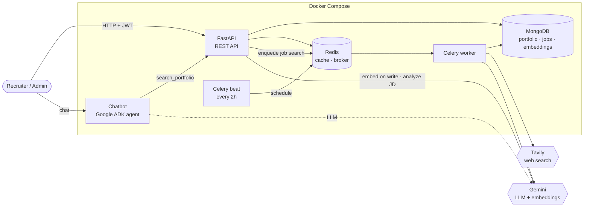
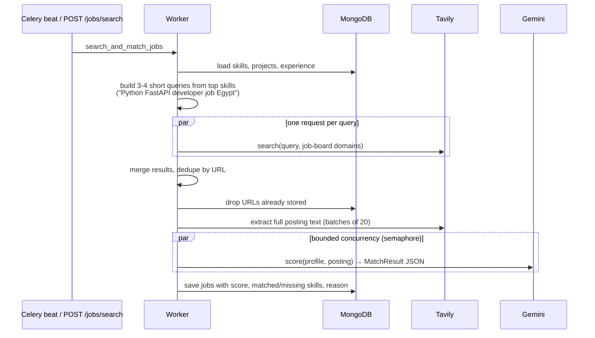

# Portfolio API

[](https://github.com/maryamosama33/portfolio-api/actions/workflows/ci.yml)

A backend for my developer portfolio that does more than store data. It **finds jobs on the web and scores how well each one fits me** with an LLM, **analyzes any job description** you paste in (fit score, skill gaps and tailored CV bullets), and powers a **RAG chatbot** that answers recruiters' questions about my work.

**Stack:** FastAPI · MongoDB (Beanie ODM) · Redis · Celery · Google Gemini (structured output + embeddings) · Tavily search · Google ADK · Docker · GitHub Actions

---

## Features

| | What it does | How |
|---|---|---|
| **AI job matching** | Every 2 hours, searches job boards for roles that fit the portfolio, reads each full posting, and scores it 0–100 with matched/missing skills and a reason. | Celery beat → Tavily search + extract → Gemini with a Pydantic `response_schema` |
| **Job description analyzer** | `POST /jobs/analyze`: paste a JD and get a fit score, skill gaps, and 3 CV bullets grounded in real projects. | Same scoring prompt and schema as the matcher |
| **RAG portfolio search** | The chatbot retrieves only the relevant projects, skills and experience instead of loading everything into the prompt. | Gemini embeddings stored in MongoDB, re-embedded on every write, cosine-similarity search |
| **Portfolio CRUD** | Projects, skills, experience with pagination, soft delete and audit fields. | Generic repository + service layers |
| **Auth** | Writes need a JWT; reads are public. | OAuth2 password flow, bcrypt, PyJWT |
| **Caching** | Read-through Redis cache, invalidated on write. Redis going down degrades to direct DB reads instead of errors. | |

## Architecture



### Job matching pipeline



Design notes:

- **Several short queries instead of one long one.** Search engines match short intent much better than a sentence listing every skill.
- **Full posting, not the snippet.** A 200-character snippet isn't enough to judge seniority or requirements, so the worker scores the extracted page text and falls back to the snippet only if extraction fails.
- **Schema-enforced LLM output.** Gemini is given the Pydantic model as `response_schema`, so every response validates to `score / matched_skills / missing_skills / reason`. Anything invalid becomes an `AIServiceError` instead of a crash.
- **Prompt-injection aware.** Job pages are untrusted web content, so they're fenced in `<job>` tags and the model is told to ignore instructions inside them.
- **Failures are retried, not stored.** A posting that fails to score isn't saved, so the next run picks it up again.

### RAG chatbot

Every create or update of a project, skill or experience embeds its text (`RETRIEVAL_DOCUMENT`) into the `portfolio_embeddings` collection. Deletes remove the embedding. The agent's `search_portfolio(query)` tool calls `GET /portfolio/search`, which embeds the question (`RETRIEVAL_QUERY`) and returns the top-k entries by cosine similarity.

For a portfolio-sized corpus (tens of documents) in-process cosine similarity is simple and fast. At larger scale this would move to MongoDB Atlas `$vectorSearch`. Indexing is best-effort: a Gemini outage never blocks editing the portfolio, and `POST /portfolio/reindex` repairs anything missed.

## API

Interactive docs at **http://localhost:8000/docs**. Click **Authorize** and log in with the admin credentials to try the protected routes.

| Method | Path | Auth | Description |
|---|---|:-:|---|
| `POST` | `/api/v1/auth/token` | | Log in, returns a JWT |
| `GET` | `/api/v1/{projects,skills,experiences}` | | Paginated list (`?page=&size=`; experiences also `?company=`) |
| `GET` | `/api/v1/{projects,skills,experiences}/{id}` | | Get one |
| `POST` `PUT` `DELETE` | `/api/v1/{projects,skills,experiences}[/{id}]` | 🔒 | Create / update / soft-delete |
| `GET` | `/api/v1/jobs?min_score=70&limit=50` | | Matched jobs, best fit first |
| `POST` | `/api/v1/jobs/search` | 🔒 | Start a background job search, returns `task_id` |
| `GET` | `/api/v1/jobs/search/{task_id}` | | Search status and summary |
| `POST` | `/api/v1/jobs/analyze` | 🔒 | Fit score, gaps and 3 CV bullets for a pasted JD |
| `GET` | `/api/v1/portfolio/search?q=` | | Semantic search (used by the chatbot) |
| `POST` | `/api/v1/portfolio/reindex` | 🔒 | Rebuild all embeddings |
| `GET` | `/health` | | Liveness check |

<details>
<summary>Example: <code>POST /api/v1/jobs/analyze</code></summary>

```json
{
  "score": 78,
  "matched_skills": ["Python", "FastAPI", "MongoDB", "Docker"],
  "missing_skills": ["AWS", "PostgreSQL"],
  "reason": "Strong backend fit with matching stack; lacks the requested cloud experience.",
  "cv_bullets": [
    "Built a FastAPI + MongoDB REST API with JWT auth, Redis caching and soft deletes...",
    "Designed a Celery pipeline that searches job boards and scores postings with Gemini...",
    "Containerised a 6-service system with Docker Compose and CI on GitHub Actions..."
  ]
}
```
</details>

## Running it

**1. Configure**

```bash
cp .env.example .env
python -c "import secrets; print(secrets.token_urlsafe(48))"   # -> JWT_SECRET_KEY
uv run python -m scripts.hash_password                          # -> ADMIN_PASSWORD_HASH (keep the single quotes)
```

Then add `GEMINI_API_KEY` ([Google AI Studio](https://aistudio.google.com/apikey)) and `TAVILY_API_KEY` ([tavily.com](https://tavily.com)).

**2. Start everything**

```bash
docker compose up --build
```

| Service | URL |
|---|---|
| API + Swagger docs | http://localhost:8000/docs |
| Chatbot (ADK web UI) | http://localhost:8001 |

**3. Embed existing data** (once, if you had data from before embeddings existed): call `POST /api/v1/portfolio/reindex`.

### Local development without Docker

```bash
uv sync --extra test
uv run uvicorn app.main:app --reload                       # API (needs MongoDB + Redis running)
uv run celery -A app.celery_app.celery_app worker -l info  # worker
```

## Tests

```bash
uv run pytest
```

- **Unit tests** (`tests/unit`) need nothing running. Redis is replaced with `fakeredis`, and Gemini and Tavily are stubbed. They cover auth, caching and invalidation, query building, URL dedupe, the full matching pipeline (including partial failures), structured-output validation and prompt fencing.
- **Integration tests** (`tests/integration`) run against a real MongoDB: soft delete, audit fields, sorting and filtering, unique job URLs, and vector search ranking. They're skipped locally if MongoDB isn't running. CI runs them against a MongoDB service container on every push.

## Project structure

```
app/
├── main.py              # FastAPI app, lifespan, router + error handler registration
├── celery_app.py        # Celery config and the 2-hourly beat schedule
├── api/
│   ├── deps.py          # JWT auth dependency (CurrentUser)
│   ├── router.py        # mounts every v1 router under /api/v1
│   └── v1/              # one router per resource: thin, no business logic
├── core/                # settings, logging, DB, Redis cache, security, errors
├── models/              # Beanie documents (MongoDB collections)
├── schemas/             # Pydantic request/response + LLM output schemas
├── repositories/        # data access; BaseRepository hides soft-deleted docs
├── services/
│   ├── crud_service.py      # cached CRUD that keeps the RAG index in sync
│   ├── portfolio_service.py # portfolio snapshot rendered as an LLM profile
│   ├── portfolio_index.py   # embeddings + vector search (RAG)
│   ├── job_search.py        # Tavily: queries, search, extract
│   ├── matching.py          # Gemini scoring + JD analysis prompts
│   ├── job_service.py       # the matching pipeline
│   └── ai/gemini.py         # Gemini client: structured output + embeddings
└── tasks/job_matcher.py # Celery task wrapping the pipeline
chatbot/portfolio_bot/   # Google ADK agent with a search_portfolio tool
tests/{unit,integration}/
```

Requests flow **router → service → repository → model**: routers handle HTTP only, services hold the logic, and repositories are the only layer that queries MongoDB.
